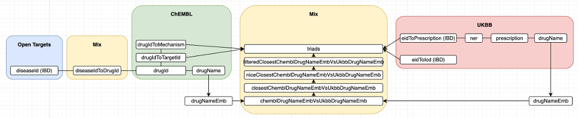

# EHR

## Objective

Connect UKBB and All of Us prescription data to ChEMBL and Open Targets Platform data (using IBD as a benchmark) in order to evaluate novel targets as therapeutic candidates.

## Data model

patient -> EHR -> prescription -> drug -> drug mechanism -> drug target VS novel target

## Code

`queryUKBB.py`: Query EHR data for IBD patients in the UKBB (available at Stanford Sherlock cluster).

`queryOT.py`: Query Open Targets Platform data (downloaded locally from http://ftp.ebi.ac.uk/pub/databases/opentargets/platform/24.09). Output stored in working directory `data/ot`.

`queryChEMBL.py`: Query ChEMBL data (downloaded locally from https://ftp.ebi.ac.uk/pub/databases/chembl/ChEMBLdb/releases/chembl_35/). Output stored in working directory `data/chembl`.

`queryMix.py`: Query data from ChEMBL, UKBB, Open Targets Platform, pathways. Output stored in working directory `data/mix`.

`nlpTools.py`: Apply NLP tools to drug data from UKBB and ChEMBL. Output stored in working directory `data/mix`.
